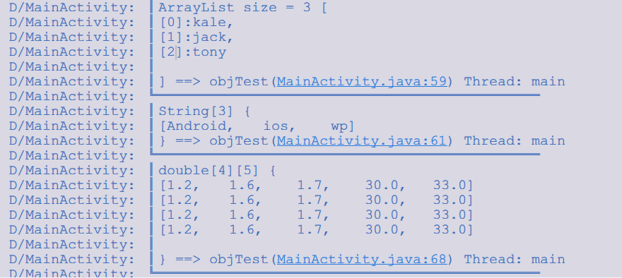
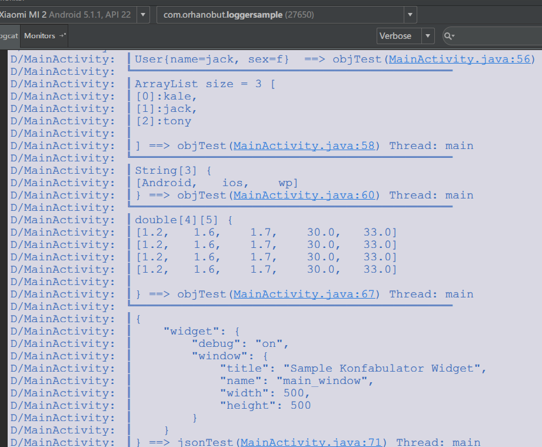
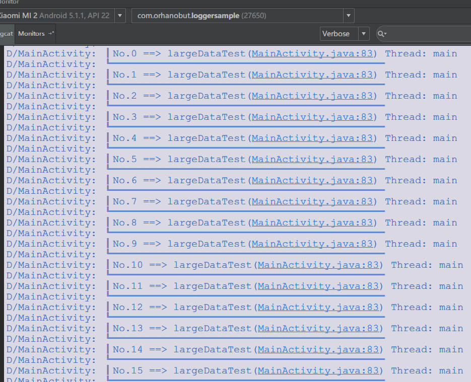
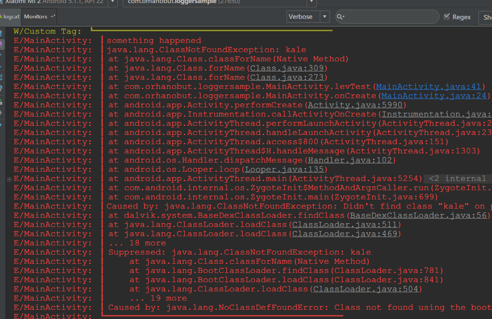

[](https://jitpack.io/#tianzhijiexian/logger)
[](http://android-arsenal.com/details/1/1658) [](http://androidweekly.net/issues/issue-147)


###Logger
Simple, pretty and powerful logger for android

Logger provides :
- Thread information
- Class information
- Method information
- Pretty-print for json content
- Pretty-print for new line "\n"
- Clean output
- Jump to source
- Smart log tag
- support large string  

### Gradle
Add it in your root build.gradle at the end of repositories:  
```groovy
allprojects {
	repositories {
		...
		maven { url "https://jitpack.io" }
	}
}
```  
Add the dependency  
> compile 'com.github.tianzhijiexian:logger:[Latest release](https://github.com/tianzhijiexian/logger/releases)'


### Logger  

  

  

  



### Usage
```java
Logger.d("hello");
Logger.e("hello");
Logger.w("hello");
Logger.v("hello");
Logger.wtf("hello");
Logger.json(JSON_CONTENT);
Logger.xml(XML_CONTENT);
logger.object(...); // bean/map/Collection...
Logger.t("Custom Tag").w("logger with custom tag");
try {
		Class.forName("kale");
} catch (ClassNotFoundException e) {
		Logger.e(e, "something happened"); // exception
}

Logger.d("first\nsecond\nthird");
```

### Settings (optional)
Change the settings with init. This should be called only once. Best place would be in application class. All of them
 are optional.
```java
public class MyApplication extends Application {

    @Override
    public void onCreate() {
        super.onCreate();
				Logger.initialize(
                Settings.getInstance()
                        .isShowMethodLink(true)
                        .isShowThreadInfo(false)
                        .setMethodOffset(0)
                        .setLogPriority(BuildConfig.DEBUG ? Log.VERBOSE : Log.ASSERT)
        );
    }
}
```
Note: Use LogLevel.NONE for the release versions.

#### You might also like
- [Hawk](https://github.com/orhanobut/hawk) Simple,powerful,secure key-value storage
- [Wasp](https://github.com/orhanobut/wasp) All-in-one network solution
- [Bee](https://github.com/orhanobut/bee) QA/Debug tool
- [DialogPlus](https://github.com/orhanobut/dialogplus) Easy,simple dialog solution
- [SimpleListView](https://github.com/orhanobut/simplelistview) Simple basic listview implementation with linearlayout

###License
<pre>
Copyright 2015 Orhan Obut

Licensed under the Apache License, Version 2.0 (the "License");
you may not use this file except in compliance with the License.
You may obtain a copy of the License at

   http://www.apache.org/licenses/LICENSE-2.0

Unless required by applicable law or agreed to in writing, software
distributed under the License is distributed on an "AS IS" BASIS,
WITHOUT WARRANTIES OR CONDITIONS OF ANY KIND, either express or implied.
See the License for the specific language governing permissions and
limitations under the License.
</pre>
