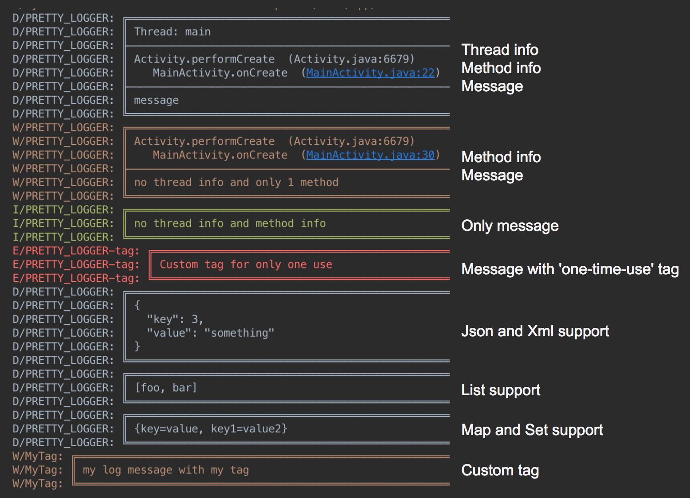

# Logger


Readable, structured logs for Android. Turn messages, collections, JSON, and XML
into output that's easy to scan in Logcat.

- Pretty output with optional thread and caller information
- JSON and XML formatting
- Readable lists, maps, and arrays
- Custom tags and log filtering
- Exception stack traces
- Flexible destinations, including Logcat and files



## Setup

Add Google Maven and Maven Central to your dependency repositories:

```kotlin
dependencyResolutionManagement {
  repositories {
    google()
    mavenCentral()
  }
}
```

```kotlin
dependencies {
  implementation("com.orhanobut:logger:2.2.0")
}
```

Initialize once in your application, then log:

```kotlin
Logger.addLogAdapter(AndroidLogAdapter())
Logger.d("hello %s", "world")
```

## Messages

```kotlin
Logger.d("debug")
Logger.e("error")
Logger.w("warning")
Logger.v("verbose")
Logger.i("information")
Logger.wtf("What a Terrible Failure")

Logger.d("hello %s", "world")
Logger.d(listOf("foo", "bar"))
Logger.d(mapOf("key" to "value"))
Logger.d(intArrayOf(1, 2, 3))
Logger.json("""{"items":[1,2,3]}""")
Logger.xml("<root><item>value</item></root>")
```

Collection and structured output use debug priority. Include an exception and its
cause with `Logger.e(throwable, "message")`.

Set a tag for exactly one message on the calling thread:

```kotlin
Logger.t("Checkout").d("Order submitted")
```

## Formatting and filtering

```kotlin
val format = PrettyFormatStrategy.newBuilder()
  .showThreadInfo(false) // Default: true
  .methodCount(0)        // Default: 2 caller frames
  .methodOffset(0)       // Default: 0 additional frames skipped
  .tag("MyApp")          // Default: PRETTY_LOGGER
  .build()

Logger.addLogAdapter(object : AndroidLogAdapter(format) {
  override fun isLoggable(priority: Int, tag: String?): Boolean = BuildConfig.DEBUG
})

Logger.t("Screen").d("A message tagged MyApp-Screen")
```

Override `LogAdapter.isLoggable` to filter messages by priority or tag. The example
above enables logging only in debug builds. Use `Logger.clearLogAdapters()` before
replacing the configured adapters.

For Logcat filtering, use `PRETTY_LOGGER` or your configured tag.

## File logging

Save formatted logs to app-private storage with `CsvFormatStrategy` and a custom
`DiskLogStrategy`. The [sample](sample/src/main/kotlin/com/orhanobut/sample/MainActivity.kt)
shows the complete setup, including background writes and cleanup. App-private
storage requires no storage permission.

The default `DiskLogAdapter()` still uses the legacy shared external-storage
location. Modern Android restricts that location through scoped storage; use the
sample's custom strategy for current applications.

## Timber integration

```kotlin
Timber.plant(object : Timber.DebugTree() {
  override fun log(priority: Int, tag: String?, message: String, t: Throwable?) {
    Logger.log(priority, tag, message, t)
  }
})
```

## License

[Apache License 2.0](LICENSE)
