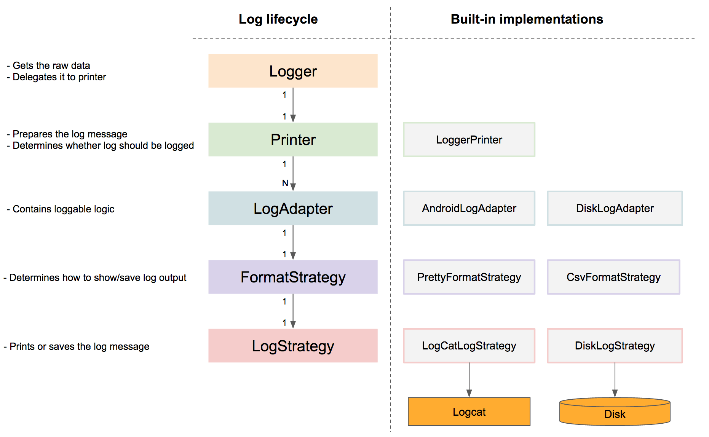

# Logger


Simple, pretty logging for Android, written entirely in Kotlin.

## Setup

Add Google Maven and Maven Central to your dependency repositories:

```kotlin
dependencyResolutionManagement {
  repositories {
    google()
    mavenCentral()
  }
}
```

The last published release is 2.2.0. This Kotlin migration builds as
`2.3.0-SNAPSHOT` and has not been released to Maven Central.

```kotlin
dependencies {
  implementation("com.orhanobut:logger:2.2.0")
}
```

Initialize once in your application, then log:

```kotlin
Logger.addLogAdapter(AndroidLogAdapter())
Logger.d("hello %s", "world")
```

## Output


## Messages

```kotlin
Logger.d("debug")
Logger.e("error")
Logger.w("warning")
Logger.v("verbose")
Logger.i("information")
Logger.wtf("What a Terrible Failure")

Logger.d("hello %s", "world")
Logger.d(listOf("foo", "bar"))
Logger.d(mapOf("key" to "value"))
Logger.d(intArrayOf(1, 2, 3))
Logger.d(null as Any?)

Logger.json("""{"items":[1,2,3]}""")
Logger.xml("<root><item>value</item></root>")
```

Collection and structured output use debug priority. Use `Logger.e(throwable,
"message")` to include an exception and its cause. `Logger.t("tag")` sets a tag
for exactly one message on the calling thread.

## Formatting and filtering

```kotlin
val format = PrettyFormatStrategy.newBuilder()
  .showThreadInfo(false) // Default: true
  .methodCount(0)        // Default: 2 caller frames
  .methodOffset(0)       // Default: 0 additional frames skipped
  .tag("MyApp")          // Default: PRETTY_LOGGER
  .build()

Logger.addLogAdapter(object : AndroidLogAdapter(format) {
  override fun isLoggable(priority: Int, tag: String?): Boolean = BuildConfig.DEBUG
})

Logger.t("Screen").d("A message tagged MyApp-Screen")
```

`FormatStrategy` and `LogStrategy` are Kotlin functional interfaces, so custom
formatters and destinations can be supplied with lambdas. Override
`LogAdapter.isLoggable` to filter messages by priority or tag. Use
`Logger.clearLogAdapters()` before replacing the configured adapters.

## File logging

Use `CsvFormatStrategy` with `DiskLogStrategy` and an Android `Handler` that writes
to app-private storage. The [Kotlin sample](sample/src/main/kotlin/com/orhanobut/sample/MainActivity.kt)
shows the complete setup using `filesDir`, a background `HandlerThread`, and
shutdown in `onDestroy`. App-private storage requires no storage permission.

The default `DiskLogAdapter()` still uses the legacy shared external-storage
location. Modern Android restricts that location through scoped storage; use the
sample's custom strategy for current applications.

## How it works



For Logcat filtering, use `PRETTY_LOGGER` or your configured tag.

Timber integration:

```kotlin
Timber.plant(object : Timber.DebugTree() {
  override fun log(priority: Int, tag: String?, message: String, t: Throwable?) {
    Logger.log(priority, tag, message, t)
  }
})
```

## Building from source

Use JDK 17 or newer, Android SDK Platform 37.0, and Android SDK Build Tools 37.0.0.
Set `ANDROID_HOME` or put your SDK path in an untracked `local.properties` file:

```properties
sdk.dir=/path/to/android/sdk
```

The build uses Gradle 9.8.0, Android Gradle Plugin 9.4.1, and built-in Kotlin support
with Kotlin 2.4.20. Sources, tests, the sample, and Gradle build scripts use Kotlin.
Dependency versions live in `gradle/libs.versions.toml`. The library retains its
declared minimum SDK of 8 and JVM 8 bytecode; the sample requires API 23 and
targets API 37. Device compatibility is not verified by the JVM tests.

Unit tests use JUnit 4 and a test-only JSON implementation. They cover log levels,
adapter filtering, tag isolation, exceptions, JSON/XML handling, UTF-8 message
chunking, and pretty/CSV formatting. They use recording adapters without
Robolectric, Truth, or Mockito. Android Logcat, Handler/Looper behavior, and device
storage are outside this unit-test suite.

Nullability is expressed with Kotlin types, with no AndroidX annotation dependency.
Kotlin's standard library is the only direct runtime dependency. Android supplies
the platform APIs and JSON implementation. Existing static JVM logger entry
points and builder methods are retained; non-null parameters (including vararg
arrays) reject null at the JVM boundary.

```sh
./gradlew check :logger:assembleRelease :sample:assembleDebug
./gradlew :logger:generatePomFileForMavenPublication :logger:javaDocReleaseJar
```

## Publishing

Android libraries are distributed as AARs with dependency metadata in Maven
repositories. Maven Central is the recommended destination for public releases.
This project uses the
[Vanniktech Maven Publish plugin](https://vanniktech.github.io/gradle-maven-publish-plugin/central/)
with Sonatype's Central Portal.

Publishing requires a verified namespace, a Central Portal user token, and a GPG
signing key. Publishing under `com.orhanobut` requires rights to that namespace;
forks should configure a namespace they control.

Keep credentials outside the repository, for example as CI environment variables:

```text
ORG_GRADLE_PROJECT_mavenCentralUsername
ORG_GRADLE_PROJECT_mavenCentralPassword
ORG_GRADLE_PROJECT_signingInMemoryKey
ORG_GRADLE_PROJECT_signingInMemoryKeyPassword
```

Set `VERSION_NAME` in `gradle.properties` to a new, unused release version before
publishing. To upload for validation, then approve the release in the
[Central Portal](https://central.sonatype.com/publishing/deployments):

```sh
./gradlew :logger:publishToMavenCentral
```

For local integration testing without credentials:

```sh
./gradlew :logger:publishToMavenLocal -PsignAllPublications=false
```

Snapshot versions go to the Central Portal snapshot repository. Published release
versions are immutable.

## License
<pre>
Copyright 2018 Orhan Obut

Licensed under the Apache License, Version 2.0 (the "License");
you may not use this file except in compliance with the License.
You may obtain a copy of the License at

   http://www.apache.org/licenses/LICENSE-2.0

Unless required by applicable law or agreed to in writing, software
distributed under the License is distributed on an "AS IS" BASIS,
WITHOUT WARRANTIES OR CONDITIONS OF ANY KIND, either express or implied.
See the License for the specific language governing permissions and
limitations under the License.
</pre>
